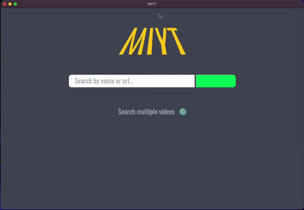

<p align="center"></p>

## What is MIYT?
### MIYT is a YouTube downloader desktop application for: Mac OS, Windows, Linux

- Download multiple videos at once, as video or audio

- Search by URL or video names

- Edit metadata of downloads

- Change video selection from app

<br/>
<p align="center"></p>

## Download

### [Visit the MIYT website where you can download the application for your OS](https://miyt.xyz)


## Usage

### Create an App

```
# with npx
$ npx create-nextron-app my-app --example custom-build-options

# with yarn
$ yarn create nextron-app my-app --example custom-build-options

# with pnpx
$ pnpx create-nextron-app my-app --example custom-build-options
```

### Install Dependencies

```
$ cd my-app

# using yarn or npm
$ yarn (or `npm install`)

# using pnpm
$ pnpm install --shamefully-hoist
```

### Use it

```
# development mode
$ yarn dev (or `npm run dev` or `pnpm run dev`)

# production build
$ yarn build (or `npm run build` or `pnpm run build`)
```
